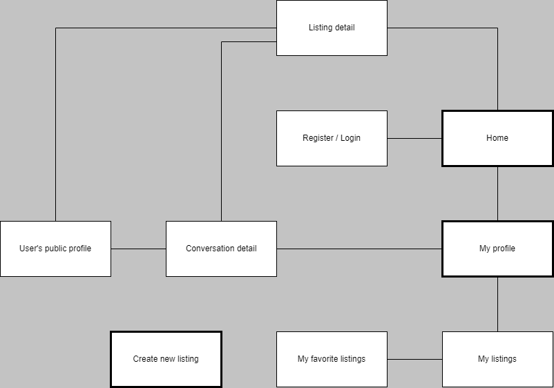
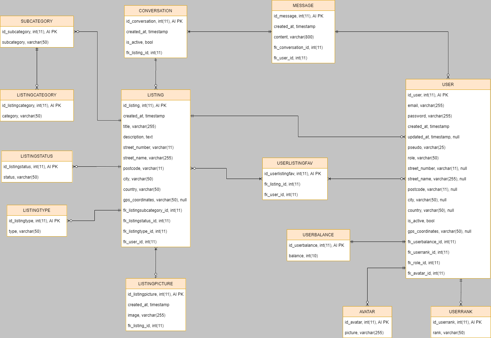
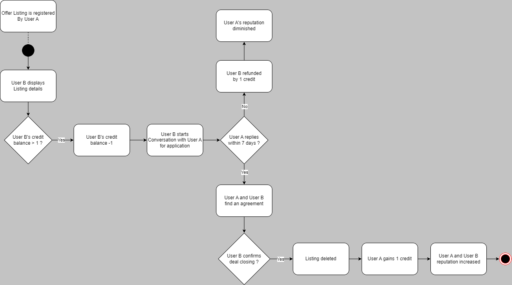

# reCycle

## Table des matières
- [Introduction](#introduction)
- [Fonctionnalités](#fonctionnalités)
- [Conception](#conception)
- [Technologies](#technologies)
- [Principales dépendances Symfony](#principales-dépendances-symfony)
- [Prérequis](#prérequis)
- [Installation](#installation)

## Introduction
"reCycle" est une plateforme permettant aux utilisateurs d’échanger des biens et services sans impliquer d’argent. De cette manière, ils peuvent donner une seconde vie à des objets dont ils n’ont plus besoin, et ceux qui n’en ont pas à distribuer peuvent toujours s’impliquer en proposant leurs compétences à travers des services.
Cette application est grandement inspirée de Leboncoin et Geev.
Un système de points a été pensé pour équilibrer les échanges, garantissant que plus vous donnez, plus vous êtes en mesure de recevoir. Chaque utilisateur a un profil public qui affiche son expérience dans l’application, incluant sa date d’inscription et le nombre de transactions qu’il a conclu avec succès.
Du point de vue technique, reCycle est basée sur un back-end Symfony servant d’API à des interfaces web en React.js (publique et back-office) et une interface mobile en React native. L'API REST est sécurisée par JWT.
Ce dépôt contient la partie Symfony du projet.

## Fonctionnalités
- *(Utilisateur)* Inscription / Connexion / Mot de passe oublié
- *(Utilisateur)* Créer des annonces
- *(Utilisateur)* Consulter la liste des annonces
- *(Utilisateur)* Filtrer la liste des annonces
- *(Utilisateur)* Rechercher des annonces par mots clé
- *(Utilisateur)* Enregistrer des annonces en favoris
- *(Utilisateur)* Contacter l’auteur d’une annonce via un chat
- *(Utilisateur)* Consulter son profil personnel
- *(Utilisateur)* Consulter les profils publics des autres utilisateurs
- *(Utilisateur)* Valider une transaction
- *(Utilisateur)* Système de points pour équilibrer les échanges
- *(Administrateur)* Modérer les publications
- *(Administrateur)* Gérer le contenu global (CRUD)

## Conception

  
   
  <em>Arborescence</em>

  
   
  <em>Schéma de base de données</em>

  
   
  <em>Diagramme d'activité - Répondre à une annonce</em>

## Technologies
- **Symfony**: Framework PHP utilisé pour le développement de l'application web.
- **Docker**: Plateforme de conteneurisation utilisée pour isoler et exécuter les services de l'application, tels que PHP, MySQL et Nginx, de manière cohérente et portable.
- **MySQL**: Système de gestion de base de données relationnelle utilisé pour stocker et gérer les données de l'application.
- **Nginx**: Serveur web utilisé pour servir les fichiers statiques et gérer les requêtes HTTP vers l'application Symfony.
- **Composer**: Gestionnaire de dépendances PHP utilisé pour installer et gérer les bibliothèques PHP requises par le projet.
- **Node.js**: Plateforme JavaScript utilisée pour exécuter des outils de développement frontend, tels que les compilateurs de CSS et les gestionnaires de paquets.
- **PHPMailer**: Bibliothèque PHP utilisée pour envoyer des e-mails à partir de l'application Symfony.
- **phpMyAdmin**: Outil d'administration de base de données web utilisé pour gérer facilement la base de données MySQL.

## Principales dépendances Symfony
- **Doctrine Bundle**: Intégration de Doctrine ORM dans Symfony.
- **Doctrine Migrations Bundle**: Bundle Symfony pour gérer les migrations de base de données avec Doctrine ORM.
- **JWT Authentication Bundle**: Bundle Symfony pour l'authentification JSON Web Token (JWT).
- **Cors Bundle**: Bundle Symfony pour gérer les requêtes Cross-Origin Resource Sharing (CORS).
- **Reset Password Bundle**: Bundle Symfony pour la réinitialisation de mot de passe.
- **Mailer Component**: Composant Symfony pour l'envoi d'e-mails.
- **Form Component**: Composant Symfony pour la création et la gestion de formulaires.
- **Framework Bundle**: Bundle principal de Symfony, fournissant des fonctionnalités de base pour les applications web.
- **Security Bundle**: Bundle Symfony pour la gestion de la sécurité, y compris l'authentification et l'autorisation.
- **Validator Component**: Composant Symfony pour la validation des données.
- **Routing Component**: Composant Symfony pour la gestion des routes dans l'application web.

## Prérequis
Avant de commencer l'installation et l'utilisation de ce projet, assurez-vous que votre environnement répond aux prérequis suivants :

- **Docker**: Assurez-vous d'avoir Docker installé sur votre machine. Si ce n'est pas le cas, vous pouvez le télécharger et l'installer depuis le [site officiel de Docker](https://www.docker.com/get-started).
- **Git**: Vous aurez besoin de Git pour cloner ce projet depuis un référentiel distant. Si Git n'est pas encore installé sur votre système, vous pouvez le télécharger et l'installer depuis le [site officiel de Git](https://git-scm.com/downloads).
- **Variables d'Environnement**: Avant de lancer les conteneurs Docker, assurez-vous d'avoir configuré les variables d'environnement suivantes :
  - `MYSQL_ROOT_PASSWORD`, `MYSQL_PASSWORD`, `MYSQL_USER`, `MYSQL_DATABASE`: Ces variables définissent les informations de connexion à la base de données MySQL.
  - `NODEJS_VERSION`: Version de Node.js utilisée dans le conteneur PHP.

## Installation
1. Cloner le projet en local.
2. Construire les images Docker avec la commande `docker-compose build`.
3. Démarrer les conteneurs Docker avec `docker-compose up -d`.
4. Accéder au conteneur PHP avec `docker-compose exec php bash` et exécuter `composer install` pour installer les dépendances PHP.
5. Créer la base de données en exécutant les migrations Doctrine avec `docker-compose exec php php bin/console doctrine:migrations:migrate`.

Une fois ces étapes terminées, vous devriez avoir votre projet Symfony exécutant localement avec Docker. Vous pouvez accéder à votre application via http://localhost. Le phpMyAdmin est également accessible via http://localhost:8080.